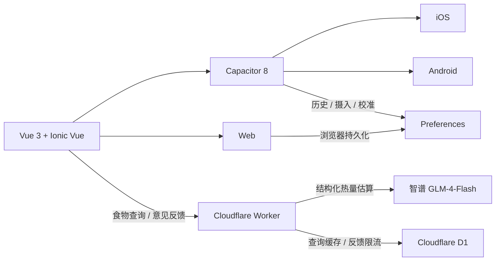

<div align="center">
  <picture>
    <source media="(prefers-color-scheme: dark)" srcset="./mobile/public/calorie-ai-logo-dark.png">
    
  </picture>

  <h1>热量快查</h1>

  <p>用自然语言查询食物热量，记录每日摄入，并通过热量校准与趋势对比理解饮食。</p>

  <p>
    
    
    
    
    
  </p>
</div>

---

## 产品简介

**热量快查**是一款面向日常饮食场景的跨平台热量查询与摄入记录应用。用户可以输入或按住麦克风说出“炒饭”“一碗热干面”等自然语言，应用会识别食物、估算常见份量与整份热量，并给出可能范围和可信度。

查询结果可直接加入当天记录；应用会汇总每日摄入、保存逐条明细，并允许通过运动或人工修正进行热量校准。核心记录默认保存在设备本地，不依赖账号体系，也不会在设备间同步。

> AI 估算会受食材重量、配方和烹饪方式影响。结果仅供饮食记录参考，不构成医疗或营养建议。

## 核心能力

| 模块 | 能力 |
| --- | --- |
| AI 热量查询 | 支持键盘和按住说话输入，估算食物名称、常见份量、成品重量、总热量、可能范围与可信度 |
| 结果对比 | 支持“同为一份”与“同等重量（100 克）”两种口径，可锁定基准结果持续比较 |
| 每日记录 | 一键记录查询结果，按日期汇总食物、热量与校准后的总摄入 |
| 热量校准 | 针对任意记录日增加或减少热量，支持备注和多次校准，并保留每次明细 |
| 摄入趋势 | 展示近 30 天摄入折线图，可点按日期查看对应热量；记录页保留近 60 天数据 |
| 历史管理 | 查询历史最多保留 200 条，支持单条左滑删除、清空及对比项锁定 |
| 个性化体验 | 跟随系统、浅色、深色三种主题；适配安全区、键盘、启动页和移动端交互 |
| 原生体验 | iOS 液态玻璃导航与确认交互适配，Android 原生启动主题和自适应图标 |
| 意见反馈 | 应用内填写标题与内容，通过 Worker 邮件服务直接发送给开发者 |

## 产品设计

- **先查询，再记录**：查询结果卡片直接进入当天摄入，减少重复输入。
- **区间而非伪精确值**：同时展示中心估算、可能范围和可信度，明确 AI 结果的不确定性。
- **份量与重量双口径**：既能比较实际的一份，也能统一换算为每 100 克进行横向比较。
- **本地优先（Local-first）**：查询历史、摄入和校准明细主要保存在当前设备，应用可独立管理和清除数据。
- **渐进式原生增强**：Web、iOS、Android 共用 Vue 界面，在原生端按平台能力增强导航、存储、主题和反馈交互。

## 数据与隐私

| 数据 | 存储位置 | 保留策略 |
| --- | --- | --- |
| 查询历史 | 当前设备 Preferences | 最多 200 条 |
| 摄入与校准记录 | 当前设备 Preferences | 最近 60 个自然日 |
| 主题与对比锁定 | 当前设备 Preferences | 用户主动修改或清除前保留 |
| AI 查询缓存 | Cloudflare D1 | 7 天，缓存键包含模型与提示词版本 |
| 意见反馈限流 | Cloudflare D1 | 仅保存限流所需的散列标识和计数 |

应用不提供账号、云同步或跨设备数据迁移。用户可在设置页的“数据存储”中一次清除查询历史、摄入记录和热量校准记录。

## 技术架构



### 技术栈

- **客户端**：Vue 3.5、TypeScript、Ionic Vue 9、Pinia、Vue Router、Vite
- **跨平台运行时**：Capacitor 8，目标平台为 iOS、Android 与 Web
- **本地数据**：Capacitor Preferences，Store 内存态统一批量写回
- **原生输入**：Capgo Speech Recognition + Capacitor Haptics
- **服务端**：Cloudflare Workers、Cloudflare D1、Cloudflare Email Service
- **AI 服务**：智谱 `glm-4-flash-250414`，关闭深度思考并使用结构化 JSON 输出
- **数据校验**：Zod；客户端、Worker 和 AI 响应均执行边界校验
- **质量保障**：Vitest、Vue TypeScript 编译检查、Worker TypeScript 检查

### AI 查询链路

1. 客户端规范化输入并向 Worker 发起查询。
2. Worker 使用“模型 + 提示词版本 + 输入内容”生成缓存键，优先读取 D1 七天缓存。
3. 未命中缓存时调用智谱模型，要求返回整份熟制食物的结构化估算。
4. Zod 校验字段、类型及数值范围；异常响应最多执行一次纠正请求。
5. 服务端确定性计算总热量与估算区间，并在响应后异步写入缓存，减少查询等待时间。

## 项目结构

```text
calorie-api/
├── mobile/                   # Vue / Ionic / Capacitor 客户端
│   ├── src/
│   │   ├── components/       # 结果卡片、趋势图等通用组件
│   │   ├── composables/       # 语音会话、Toast 与原生确认框
│   │   ├── pages/            # 查询、记录、详情、历史、设置页面
│   │   ├── services/         # 查询、存储、主题与原生桥接
│   │   └── stores/           # Pinia 状态管理
│   ├── android/              # Android 原生工程
│   ├── ios/                  # iOS 原生工程
│   └── scripts/              # Android APK 自动打包脚本
├── worker/                   # Cloudflare Worker API
│   ├── migrations/           # D1 数据库迁移
│   ├── src/                  # API、领域计算与智谱适配层
│   └── test/                 # Worker 单元测试
└── package.json              # npm workspace 与统一命令
```

## 本地开发

### 环境要求

- Node.js 22 或更高版本
- npm 10 或更高版本
- Cloudflare 账号与 Wrangler CLI 登录状态
- 智谱开放平台 API Key
- 构建 Android 时需要 JDK 21、Android SDK Platform 36
- 构建 iOS 时需要 macOS、Xcode 和有效的 Apple 签名配置

### 1. 安装依赖

```bash
git clone https://github.com/Anuluca/calorie.git
cd calorie
npm install
```

### 2. 配置 Worker

在 `worker/.dev.vars` 中写入本地开发密钥：

```dotenv
ZHIPU_API_KEY=你的智谱_API_Key
```

初始化本地 D1 数据库：

```bash
npm run db:migrate:local --workspace worker
```

> `worker/.dev.vars` 已加入 Git 忽略规则。不要把 API Key、Cloudflare Token 或其他密钥提交到仓库。

### 3. 配置客户端

```bash
cp mobile/.env.example mobile/.env
```

将本地 Worker 地址写入 `mobile/.env`：

```dotenv
VITE_API_BASE_URL=http://localhost:8787
```

### 4. 启动开发服务

分别启动 Worker 和客户端：

```bash
npm run worker:dev
```

```bash
npm run dev
```

客户端默认运行在 `http://localhost:5173`，Worker 默认运行在 `http://localhost:8787`。

## 构建与发布

### Web 构建与完整检查

```bash
npm run test
npm run build
```

`npm run build` 会构建客户端，并对 Worker 执行 TypeScript 检查。

### Android APK / AAB

仓库提供了一键打包脚本，会依次执行 Web 构建、Capacitor 同步和 Gradle Release 打包：

```bash
npm run apk --workspace mobile
```

构建产物固定输出到：

```text
mobile/outputs/android/calorie-ai-release-unsigned.apk
mobile/outputs/android/calorie-ai-release-unsigned.aab
```

两个产物默认均未签名，上架前必须使用发布密钥或上传密钥签名。

### iOS / Android 原生工程

同步 Web 资源与原生依赖：

```bash
npm run native:sync
```

打开对应平台工程：

```bash
npm run ios --workspace mobile
npm run android --workspace mobile
```

### 部署 Cloudflare Worker

生产环境密钥使用 Cloudflare Secret 管理：

```bash
cd worker
npx wrangler login
npx wrangler secret put ZHIPU_API_KEY
cd ..
```

首次部署到自己的 Cloudflare 账号时，需要创建 D1 数据库，并将返回的数据库 ID 更新到 `worker/wrangler.jsonc`：

```bash
cd worker
npx wrangler d1 create calorie-foods
cd ..
```

应用远程迁移并部署：

```bash
npm run db:migrate:remote --workspace worker
npm run worker:deploy
```

当前 Worker 配置使用自定义域名 `calorie-api.anuluca.com`。部署到其他账号或域名时，请同步修改 `worker/wrangler.jsonc` 与客户端的 `VITE_API_BASE_URL`。

### 配置意见反馈邮件

意见反馈接口依赖 Cloudflare Email Service 的 `FEEDBACK_EMAIL` 绑定：

1. 在 Cloudflare Email Routing 中启用发件域。
2. 验证目标邮箱，并配置允许的发件地址。
3. 在 `worker/wrangler.jsonc` 中更新 `send_email` 绑定。
4. 执行 D1 迁移后重新部署 Worker。

## API

| 方法 | 路径 | 说明 |
| --- | --- | --- |
| `GET` | `/health` | 返回服务状态、运行模式和当前模型 |
| `POST` | `/v1/food/query` | 根据食物描述返回结构化热量估算 |
| `POST` | `/v1/feedback` | 提交应用内意见反馈 |

查询示例：

```bash
curl -X POST http://localhost:8787/v1/food/query \
  -H 'Content-Type: application/json' \
  -d '{"text":"一碗热干面"}'
```

## 版本

当前版本：**v1.0**

- AI 食物热量查询与估算区间
- 按住说话输入、原生触感与提示音反馈
- 查询历史、结果对比与对比项锁定
- 每日摄入记录、热量校准与近 30 天趋势图
- iOS、Android、Web 三端适配
- 浅色、深色与跟随系统主题
- 应用内意见反馈与数据清理

## 开发者

**Developed & Designed by [Anuluca](https://anuluca.com)**

- GitHub：[@Anuluca](https://github.com/Anuluca)
- Email：[tilucario@outlook.com](mailto:tilucario@outlook.com)

© 2026 Anuluca. All rights reserved.
